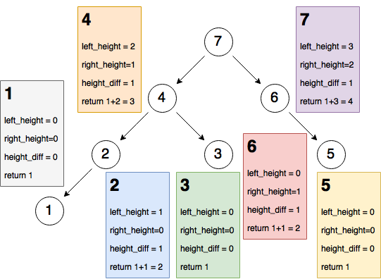
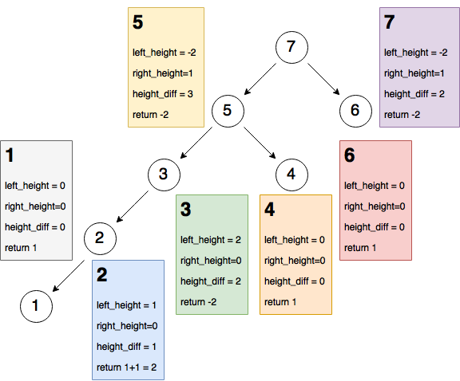

# Summary

Height-balanced tree must satisfy:
1. left subtree is balanced
2. right subtree is balanced
3. the difference between height of left subtree and right subtree is not greater than 1

# Approach #1 Top-Down Recursion [Accepted]

## Intuition

Use recursion to get height of current node from top to down 

Use additional 2 recursions to check whether subtree is balanced
- one is for left subtree and the other one is for right subtree

## Algorithm

1. construct a function for getting height of current node
    - base case: `return 0` if it reaches `None` (below the leaf)
    - recursive case: `+1` because we count current node as 1
        - plus maximal height of subtree
2. check balanced
    - `return True` if current node is `None` (no violate definitions)
    - `return False` if it violates definitions
    - calls recursive function with left child and right child

## Python

```python
def isBalanced(self, root):
    if root is None:
        return True
    height_difference = abs(self.get_height(root.left) - self.get_height(root.right))
    if height_difference > 1:
        return False
    else:
        return self.isBalanced(root.left) and self.isBalanced(root.right)

def get_height(self, root):
    if root is None:
        return 0
    else:
        return 1 + max(self.get_height(root.left), self.get_height(root.right))
```

## Time Complexity is $$O(n^{2})$$

Take skewed tree for example, $$T(n) = T(n-1) + O(n)$$ where `O(n)` is to calculate the height of node

$$T(n) = (T(n-2) + O(n-1)) + O(n) = ... = T(1) + 1 + ... + n = \sum_{i=1}^{n} i = n^{2} $$

## Space Complexity = $$O(1) or O(\log n)$$

- if we don't count stack space for recursion, time complexity is $$O(1)$$
- Skewed tree needs $$O(height of tree) = O(\log n)$$ for recursion

---

# Approach #2 Bottom-up recursion with Post order traversal [Accepted]

## Intuition

We use `post order traversal` to reach bottom of tree
- recur(left) -> recur(right) -> calculate height of node
- ensure no missing any node when we calculate height

Why we `return -2` when height was not balanced?
- `-2` can cause `height_difference` to be greater than 1 no matter what height of the other subtree
- if there is unbalanced case in any subtree, it will return `-2` in the end

## Algorithm

1. set up case for empty tree
2. define recursion function
    - base case if reaching below the leaf (there is no node here, so return 0 for height)
    - according to `post order traversal` to call recursive function and check if any unbalanced case occurs
    - calculate difference of height and check if any unbalanced case occurs
    - if subtree is valid so far, return current height(current level + height of subtree)
3. if recursive function return `-2` which is less than zero, we return `False` for unbalanced tree
    - if return value, height of tree, is greater than zero, we can say this tree is valid balanced tree

## Python

```python
def isBalanced_bottom_up(root):
    if root is None:  # empty tree 
        return True
    return True if recur_bottom_up(root) > 0 else False

def recur_bottom_up(root):
    if root is None:
        return 0
    
    # recursion to left subtree
    left_height = recur_bottom_up(root.left)
    if left_height == -2:
        return -2
    
    # recursion to right subtree
    right_height = recur_bottom_up(root.right)
    if right_height == -2:
        return -2
    
    # calculate difference of height and return current height
    height_difference = abs(left_height - right_height)
    if height_difference > 1:
        return -2
    return 1 + max(left_height, right_height)
```

#### Valid binary tree case



#### Invalid binary tree case


## Time complexity = $$O(n)$$

Post order traversal is `O(n+m)` where n is number of nodes and m is number of edges
- In binary tree, maximum number of total edges is `n-1`, so time complexity is `O(n+n-1) = O(n)`

## Space complexity = $$O(1) or O(\log n)$$

- If we don't count stack space for recursion, time complexity is `O(1)`
- skewed tree needs `O(height of tree)` for stack space

---

# Approach #3 Breadth-first search with Stack [Accepted]

## Intuition

1. We take `Breadth-first search` approach to insert node to `stack`
2. Popping stack can calculate height from bottom to top because it is `First In Last Out`
3. Use hash table `heights` to map node to height

## Algorithm

1. Initialize `stack` with `root`
2. Iterate through stack and keep pushing child node into stack
3. Now `stack` contains all nodes, then `pop` the last element in stack
4. Use hash table `heights` to find height of both subtree and check difference of heights
5. Calculate and insert current height of this node to `heights`

#### Note that `heights` must initialize with `None: 0`

Because if current node has `None` child, we can calculate its height by `heights[None] = 0`

#### Note that other keys in `height` is type of `TreeNode`, so it has little chance to become collision

If there are two nodes which have same value and same children

## Python

```python
def isBalanced_bottom_up_stack(root):
    # Use Breath first search to push node into stack
    stack = [root]
    for node in stack:
        if node:
            if node.left:
                stack.append(node.left)  # append() in Python = push
            if node.right:
                stack.append(node.right)
    
    # Calculate height of each nodes by hash table
    heights = {None: 0}
    while stack:
        node = stack.pop()  # pop() in Python = pop
        if node:
            left_height = heights[node.left]
            right_height = heights[node.right]
            if abs(left_height - right_height) > 1:
                return False
            heights[node] = 1 + max(left_height, right_height)
    return True
```

## Time complexity is $$O(n)$$

1. Pushing all nodes to `stack` needs `O(number of nodes)`
    - `append()` is `O(1)`
2. In `while stack`, it needs `O(number of nodes)` to `pop` all nodes
    - `pop()`, `max()`, `abs()` are `O(1)`
    - accessing hash table, `heights`, is `O(1)`

Above 1 and 2 are both `O(n)`, so the time complexity is `O(n+n) = O(n)`

## Space complexity is $$O(n)$$

- `stack` needs `O(n)` to contain all nodes in post order
- `heights` needs `O(n)` to record all mappings between nodes and heights

Overall space time complexity is `O(n+n) = O(n)`