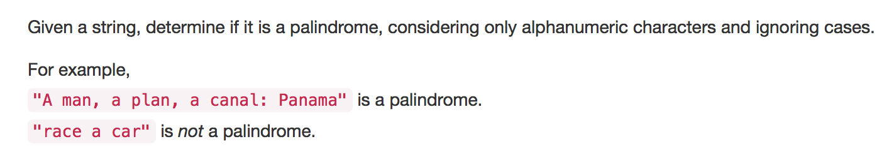

要注意大小寫問題，而且只考慮字母和數字

# regrex + slicing

1. 使用regular expression和lower()來找出小寫字和數字
2. 再用slicing來判斷是否回文

```python
check = "".join(re.findall("[a-zA-Z0-9]*", s)).lower()
        return check == check[::-1]
```

# filter() + reversed()

1. filter來過濾非小寫或非數字
    - isalnum() + lower()
2. 對著filter回傳的iterator做reversed來判斷回文

# 