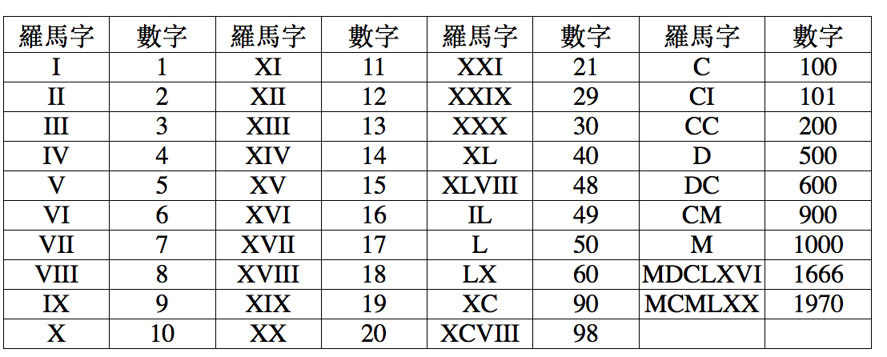

# Convert Roman to Integer



當比較大的數字在右邊時，左邊的會變成減

從右邊開始處理字串比較好，乾脆反向再從index=0開始
```python
r = str(r)[::-1]
for i in range(len(r)):
```

如果前一個數字比目前的數字大就代表目前的要變成減

```python
if roman_dict[r[i]] < roman_dict[r[i-1]]:
    total -= roman_dict[r[i]]
```
