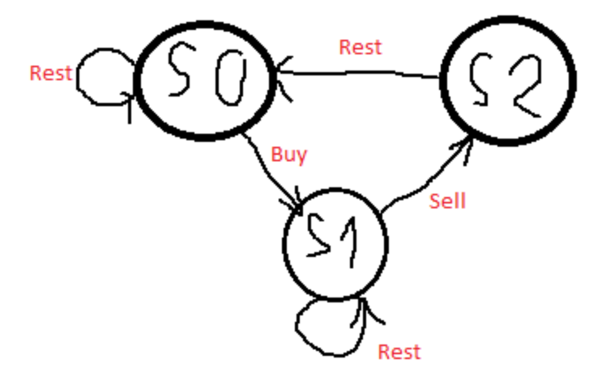

# Finite State Machine



## State

#### State 0
> 還沒buy，且可能剛sell完所以休息

1. 昨天休息
2. 昨天買所以休息

#### State 1: stockholder
> 已經買了股票

1. 休息
2. 賣出

#### State 2: sell stock

- 把股票賣出去 

---

- s0: 昨天休息 or 昨天有買所以休息
- s1: 昨天休息 or 
- s2: 因為s1是賣過來的，所以一定要休息到s0

- s0: `rest` at s0 *or* `rest` from s2
- s1: `rest` at s1 *or* `buy` from s0
- s2: `sell` from s1

```python
s0[i] = max(s0[i - 1], s2[i - 1])
s1[i] = max(s1[i - 1], s0[i - 1] - prices[i]) 
s2[i] = s1[i - 1] + prices[i]  
```

## Base Case

```python
s0[0] = 0  # At the start, you don't have any stock if you just rest
s1[0] = -prices[0] # After buy, you should have -prices[0] profit.
s2[0] = INT_MIN  # Lower base case, 其實0也可以
```


# DP solution

#### buy[i]
> 在第i天之前，最後為buy時的最大獲利

#### sell[i]
> 在第i天之前，最後為sell時的最大獲利

#### rest[i]
> 在第i天之前，最後為rest時的最大獲利

#### DP structure
```python
buy[i]  = max(休息完第i天buy, 第i天不buy) 
sell[i] = max(第i天sell, 第i天不sell)
rest[i] = max(sell完要rest, buy[i-1], 再多休息一天)
```

```python
buy[i]  = max(rest[i-1]-price, buy[i-1]) 
sell[i] = max(buy[i-1]+price, sell[i-1])
rest[i] = max(sell[i-1], buy[i-1], rest[i-1])
```

## Problem: `rest` before `buy`

- [buy, rest, buy] may occur
- 因為buy完獲利會減少，所以只需確保buy[i] <= rest[i]

## Solution: 
> rest[i] = max(sell[i-1], rest[i-1])

## Problem: Reduce `rest` function
> rest[i] <= sell[i]

```
rest[i] = sell[i-1]
```

```
buy[i] = max(sell[i-2]-price, buy[i-1])
sell[i] = max(buy[i-1]+price, sell[i-1])
```