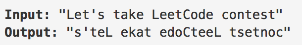

## Given a string, you need to reverse the order of characters in each word within a sentence while still preserving whitespace and initial word order.



對每一個word做reverse

# Split + Slicing

```python
' '.join(x[::-1] for x in s.split())
```
